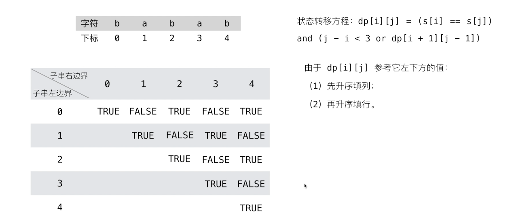

给你一个字符串 s，找到 s 中最长的回文子串

示例
输入：s = "cbbd"
输出："bb"

一个回文字符串去掉两端的字母，剩下的依然是回文，也就是说一个子串是否是回文的，取决于两端的字母是否相等，以及去掉两端字母后剩余的部分是否是回文，定义状态转移方程如下，表示左边界为 i、右边界为 j 的子串是否是回文，其中 dp[i + 1][j - 1]表示去掉两端字母后剩余的子串的回文与否

dp[i][j] = s[j] === s[i] && dp[i + 1][j - 1];

然后考虑边界条件

1. 如果左右两端不构成区间，即 j - 1 - (i + 1) + 1 < 2，化简得 j - i < 3，也就是说当子串的长度是 2 或 3 的时候，不需要去除两端再去判断剩余部分的回文与否，直接 dp[i][j] = s[j] === s[i]

2. 对于对角线上的值，也就是单个字符，一定是回文的，即 dp[i][i] = true

每当判断到一个是回文的子串时，记录其起始位置和长度，找到最长的那一个，最后截取字符串

然后分析一下遍历的过程

- 每一行表示子串的左边界，每一列表示子串的右边界，表中每个位置唯一的对应一个子串，单个字符必定是回文，所以对角线上的值都为 true

- 由于左边界一定是小于等于右边界的，所以最终遍历的是表的上半部分

- 由于 dp[i][j]需要参考 dp[i + 1][j - 1]的值，也就是下边一行、左边一列（左下角）的那个值，所以需要一列一列的遍历才能确保左下角的值先被计算出来。如判断 dp[0][4]是否是回文时，需要参考 dp[1][3]的值，而此时 dp[1][3]的值已经计算好了



```js
function longestPalindrome(s) {
  const len = s.length;
  if (len < 2) {
    return s;
  }
  const dp = Array.from(new Array(len), () => new Array(len));
  for (let i = 0; i < len; i++) {
    dp[i][i] = true;
  }
  let maxLen = 1;
  let begin = 0;
  // 列，子串的右边界
  for (let i = 1; i < len; i++) {
    // 行，子串的左边界，不能大于右边界
    for (let j = 0; j < i; j++) {
      if (s[i] !== s[j]) {
        dp[j][i] = false;
      } else {
        // 如果子串的长度时2或3，且s[i] === s[j]，一定是回文的
        if (i - j < 3) {
          dp[j][i] = true;
        } else {
          dp[j][i] = dp[j + 1][i - 1];
        }
      }

      // 每当判断到一个是回文的子串时，记录其起始位置和长度，找到最长的那一个，最后截取字符串
      if (dp[j][i] && i - j + 1 > maxLen) {
        maxLen = i - j + 1;
        begin = j;
      }
    }
  }
  return s.substring(begin, begin + maxLen);
}
```
